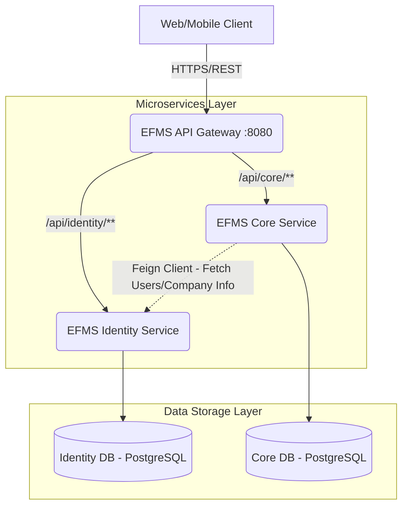

# Kiến trúc Hệ thống EFMS (Enterprise Financial Management System)

Tài liệu này mô tả kiến trúc Microservice, luồng dữ liệu, phân quyền và cấu trúc thư mục của dự án EFMS.

## 1. Sơ đồ Kiến trúc Tổng quan (System Context)

Dưới đây là sơ đồ luồng dữ liệu và giao tiếp giữa các thành phần trong hệ thống:



### 1.1 Vai trò của từng Service

*   **API Gateway (`efms-api-gateway` | Port 8080)**
    *   Điểm vào duy nhất (Single Entry Point) cho toàn bộ Client.
    *   **Nhiệm vụ:** Định tuyến request (Routing), Xử lý CORS tập trung, Xác thực Token (chỉ phân giải JWT Secret để kiểm tra tính hợp lệ cơ bản, không thực hiện RBAC).
*   **Identity Service (`efms-identity-service` | Port 8081)**
    *   Quản lý thông tin xác thực, RBAC (Role-Based Access Control) và Cấu trúc Doanh nghiệp đa chi nhánh (Multi-tenancy).
    *   **Context Path:** `/api/identity`
    *   Cấp phát JWT Tokens tại `/auth/login`.
*   **Core Service (`efms-core-service` | Port 8082)**
    *   Hạt nhân xử lý Tài chính - Kế toán: Hóa đơn, Thanh toán, Sổ nhật ký chung, Đối soát ngân hàng.
    *   **Context Path:** `/api/core`
    *   Sử dụng chung cấu trúc Users, Company bằng UUIDs do Identity quản lý nhưng **KHÔNG** tạo Foreign Key trực tiếp trên Schema.

---

## 2. Tiêu chuẩn thiết kế (Design Guidelines)

### 2.1 Multi-Tenancy (Isolated Data)
Bất kỳ Entity nào sinh ra trong nghiệp vụ (Invoices, Users, Roles, Journals...) đều bắt buộc phải gắn với một `company_id`. Ở lớp Repository và Service, mọi query đều phải đính kèm điều kiện `WHERE company_id = ?` để đảm bảo dữ liệu của công ty này không bị đọc/ghi bởi người dùng thuộc công ty khác.

### 2.2 JWT Authentication
*   User gọi API `/api/identity/auth/login` bằng thông tin đăng nhập. 
*   Identity service trả về chuỗi Token được ký (HMAC SHA) qua thư viện `jjwt`.
*   Dữ liệu trong JWT bao gồm: `userId`, `roles`, `companyId`.
*   Tất cả các API nghiệp vụ khác (vd: tạo Invoice) gửi Request kèm Header `Authorization: Bearer <token>`.
*   **Gateway** kiểm tra (Decode) Token, nếu Pass -> forward xuống nội bộ.

### 2.3 Response Chuẩn (Standard Response Wrapper)
Hệ thống sử dụng đối tượng Base Response `ApiResponse<T>` cho mọi Request trả về Client:

```json
{
  "status": 200,
  "message": "Success",
  "data": { ... }
}
```

Mọi ngoại lệ (Exceptions) ném ra trong Controller/Service đều phải được catch bởi lớp `@RestControllerAdvice` (GlobalException Handler) để format lại thành `ApiResponse` với status code hợp lý.

---

## 3. Cấu trúc Source Code (Layered Architecture)

Mỗi Microservice (Identity & Core) đều phải tuân thủ nghiêm ngặt cấu trúc gói (Package Naming Convention) sau:

*   `com.linhdv.[service_name]`
    *   `config/`: Chứa các bean configurations, SecurityFilterChain, cấu hình Cors, RestTemplate/FeignConfigs.
    *   `controller/`: Interface giao tiếp với bên ngoài. Khai báo API bằng `@RestController`, `@RequestMapping`. Dữ liệu In/Out bắt buộc sử dụng `DTO` và `ApiResponse`.
    *   `dto/`: Các Data Transfer Object để giấu chi tiết của Entity. Bao gồm packet con `request`, `response`, và `common`.
    *   `entity/`: Định nghĩa Mapping JPA với Database (Sử dụng `@Entity`, `@Table`). 
    *   `mapper/`: Chứa các Interface MapStruct (`@Mapper`). Để compiler sinh code tự động chuyển đổi giữa `Entity <-> DTO`.
    *   `repository/`: Interface extend `JpaRepository` để tương tác trực tiếp tới DB.
    *   `security/`: Custom JWT Filter (dành riêng cho nội bộ backend parsing User context).
    *   `service/` & `service/impl/`: Business Logic Layer (quy trình kiểm tra, validate liên kết, gọi repository rẽ nhánh).

### 3.1 Quy định sử dụng thư viện
*   Sử dụng **Lombok** (`@Data`, `@Builder`, `@NoArgsConstructor`, `@AllArgsConstructor`) cho tất cả các class cấu trúc (DTO, Entity) nhằm giảm boilerplate code. Ưu tiên constructor injection (thông qua `@RequiredArgsConstructor`) thay vì tiêm bean qua `@Autowired` cho Field trong các Bean/Service.
*   Trường hợp thao tác tính toán liên quan tiền tệ, bắt buộc phải dùng **`BigDecimal`**.

---

## 4. Xử lý Lịch sử thao tác (Audit Logging)
Bất kỳ sự thay đổi (Create, Update, Delete) đối với thông tin nhạy cảm của các Entity chính (Users, Invoices, Journals) đều cần được ghi đè Log vào bảng `audit_logs` của dịch vụ đó.
*   Thông tin ghi nhận bao gồm: `action`, `changed_by` (Lấy từ User context), `old_data` (JSON record cũ), `new_data` (JSON record mới), `changed_at`.
*   Frontend lấy lịch sử thao tác thông qua API `/v1/audit-logs/record` cấp ở mỗi service.
